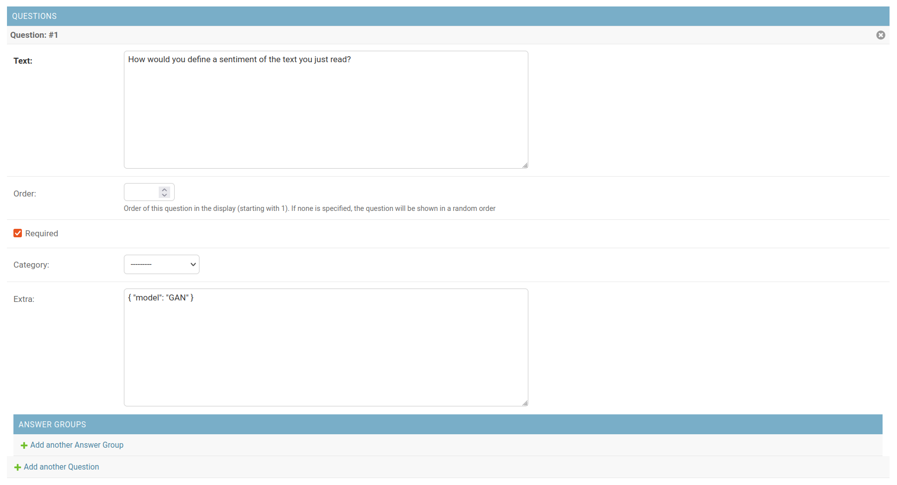
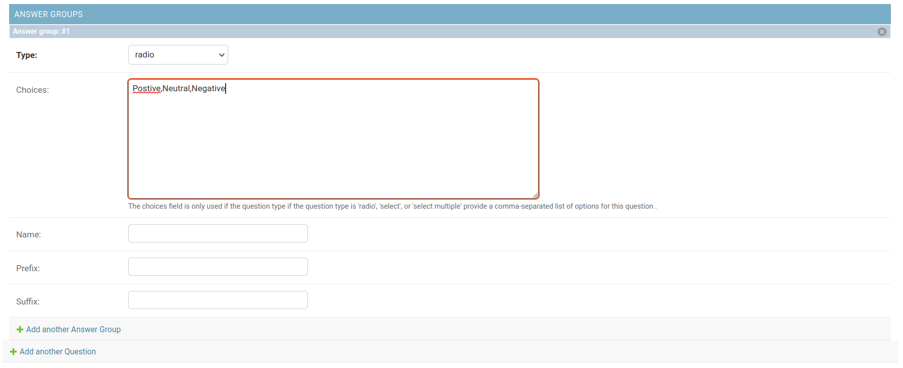

# Django scientific survey

A django survey app for conducting scientific surveys, based on "django-survey-and-report" by Pierre Sassoulas.
The following changes were made to the original app to accommodate scientific use cases:

* Introduced answer groups for the use cases when a datapoint should be evaluated using multiple different aspects. For instance, for a given text, you might want to evaluate its naturalness on the scale from 1 to 5, its fluency on the scale from 1 to 10 and its coherence on the scale from 1 to 4.
* Added a field called "extra" to the Question model to carry out some extra question-specific information. This information will be invisible to the end user and will be simply transfered to the exported survey results for easier analysis later. For instance, this can hold the information about the model that has generated the text.
* Added the possibility of using external redirect on finishing the survey, which is useful for integrating with crowdsourcing platforms frequently used for human evaluation, such as [Prolific](https://www.prolific.co/).
* Changed import and export format from CSV to JSON and added the answer groups and the "extra" field to this format.
* Added the possibility to randomize the order of questions for each survey participant.
* Added the possibility to import surveys from a JSON file.

Recognizing that these changes are not necessarily useful for the users of the original "django-survey-and-report" app (and that the code became more different from the original than expected initially), it was decided to create a separate package "django-scientific-survey" to acommodate these changes.

## Table of contents

* [Language available](#language-available)
* [Getting started](#getting-started)
* [Making a survey](#making-a-survey)
  * [Manually through admin UI](#manually-through-admin-interface)
  * [Importing configuration from a JSON file](#by-importing-configuration-from-a-json-file)
* [Contributing as a developer](#contributing-as-a-developer)
  * [Development environment](#development-environment)
  * [Committing code](#committing-code)
    * [Launching tests](#launching-tests)
    * [Adding test data](#adding-test-data)
    * [Launching coverage](#launching-coverage)
    * [Applying Lint](#applying-lint)
* [Translating the project](#translating-the-project)
  * [As a developer](#as-a-developer)
  * [As a translator](#as-a-translator)
* [Credit](#credits)

## Language available

The software is developed in English.

Full translation is available for these languages (in alphabetical order):

* [x] Russian thanks to [Vlad M.](https://github.com/manchos/) and [Dmytro Kalpakchi](https://github.com/dkalpakchi)
* [x] Ukrainian thanks to [Dmytro Kalpakchi](https://github.com/dkalpakchi)

Partial translation (due to the contributions to the original "django-survey-and-report") are available for these languages (in alphabetical order):

* [x] Brazilian-Portuguese thanks to [Rafael Capaci](https://github.com/capaci)
* [x] Chinese thanks to [朱聖黎 (Zhu Sheng Li)](https://github.com/digglife/)
* [x] French thanks to [Pierre Sassoulas](https://github.com/Pierre-Sassoulas/)
* [x] German thanks to [Georg Elsas](https://github.com/gjelsas)
* [x] Indonesian thanks to [Dhana Dhira](https://github.com/ddhira123)
* [x] Japanese thanks to [Nobukuni Suzue](https://github.com/nsuzue/)
* [x] Polish thanks to [Daniel Horner](https://github.com/d-horner/)
* [x] Spanish thanks to [Javier Ordóñez](https://github.com/ordonja/)

## Getting started

Add `django-scientific-survey` to your requirements and get it with pip.

~~~~bash
echo 'django-scientific-survey' > requirements.txt
pip install -r requirements.txt
~~~~

Add `bootstrapform` and `survey` in the `INSTALLED_APPS` in your settings :

~~~~python
INSTALLED_APPS = [
	# Your own installed apps here
]

...

INSTALLED_APPS += [
	'bootstrapform',
	'scientific_survey'
]
~~~~

Add an URL entry to your project’s urls.py, for example:

~~~python
from django.conf import settings
from django.conf.urls import include, url

urlpatterns = [
    # Your own url pattern here
]

if 'scientific_survey' in settings.INSTALLED_APPS:
    urlpatterns += [
        url(r'^survey/', include('scientific_survey.urls'))
    ]
~~~~

Note: you can use whatever you wish as the URL prefix.

You can also change some other options:

~~~~python
# The separator for questions (Default to ",")
CHOICES_SEPARATOR = "|"

# What is shown in export when the user do not answer (Default to "Left blank")
USER_DID_NOT_ANSWER = "NAA"
~~~~

To uninstall `django-scientific-survey`, simply comment out or remove the `scientific_survey` line in your `INSTALLED_APPS`.

## Making a survey

### Manually through admin interface

Using the admin interface you can create surveys, add questions, give questions categories, define multiple answer groups per question, mark them as required or not, etc.

For instance, if you want the respondents to read a text and define its sentiment, you might want to ask "How would you define a sentiment of a text you just read?". This question can be created via the admin interface as shown below.

Now if you wanted to give participants 3 options: "Positive", "Neutral" and "Negative", you could do that via the admin interface as well by adding an answer group, as shown below.

The front-end survey view then automatically populates based on the questions that have been defined and published in the admin interface. We use bootstrap3 to render them.

Submitted responses can be viewed via the admin backend and exported in the JSON format.

### By importing configuration from a JSON file

You can also create a survey by importing it from a JSON file, which is very handy for large surveys containing hundreds of questions. You can do this via the admin interface using "Import from JSON" button in the "Surveys" menu.

The format of the import file is self-explanatory and some examples of such files can be found [here](https://github.com/dkalpakchi/django-scientific-survey/tree/master/example_surveys).

## Contributing as a developer

### Development environment

This is the typical command you should do to get started:

~~~~bash
python -m venv venv/ # Create virtualenv
source venv/bin/activate # Activate virtualenv
pip install -e ".[dev]" # Install dev requirements
pre-commit install # Install pre-commit hook framework
python manage.py migrate # Create database
python manage.py loaddata survey/tests/testdump.json # Load test data
python manage.py createsuperuser
python manage.py runserver # Launch server
~~~~

Please note that `pre-commit` will permit to fix a lot of linting error
automatically and is not required but highly recommended.

### Committing code

#### Launching tests

**NOTE:** Test overhaul is in progress

~~~~bash
python manage.py test survey
~~~~

#### Adding test data

If you want to dump a test database after adding data to it, this is
the command to have a minimal diff :

~~~~bash
python manage.py dumpdata --format json -e contenttypes -e admin -e auth.Permission
-e sessions.session -e sites.site --natural-foreign --indent 1
-o survey/tests/testdump.json
~~~~

#### Launching coverage

~~~~bash
coverage run --source=survey --omit=survey/migrations/* ./manage.py test
coverage html
xdg-open htmlcov/index.html
~~~~

#### Applying Lint

We're using `pre-commit`, it should take care of linting during commit.

## Translating the project

Django-scientific-survey is available in multiple language.
Your contribution would be very appreciated if you
know a language that is not yet available.

### As a developer

If your language do not exists add it in the `LANGUAGE` variable in the settings, like [here](https://github.com/Pierre-Sassoulas/django-survey/commit/ee3bdba26c303ad12fc4584938e724b39223faa9#diff-bdf3ecebd8379ca98cc89e545fc90899).
Do not forget to credit yourself like in the header seen [here](https://github.com/Pierre-Sassoulas/django-zxcvbn-password-validator/commit/274d7c9b27268a0455f80ea518c452532b970ea4#diff-8015f170326f20998060314fda9b92b1)

In order to add translation files you first need to run for your own locale (change `-l` flag to the locale of your choice, e.g. 'ru', 'es', 'fr', etc.).
~~~~bash
python manage.py makemessages --no-obsolete --no-wrap --ignore venv -l uk
~~~~

Then run the server, as usual (`python manage.py runserver`) and access `http://localhost:8000/admin` to login.
Then go to `http://localhost:8000/rosetta` to translate

Afterwards addd your translations to GitHub
~~~~bash
git add survey/locale/
~~~~

If your language is not yet available in rosetta, [this stack overflow question](https://stackoverflow.com/questions/12946830/) should work even for language not handled by django.

### As a translator

If you're not a developer, open an issue on github and ask for a .po file in your language. I will generate it for you, so you can edit it with an online editor. I will then create the .po and commit them, so you can edit them with your github account or integrate it myself if you do not have one. You will be credited [here](https://github.com/Pierre-Sassoulas/django-survey#language-available).

## Credits

Based on [django-survey-and-report by Pierre Sassoulas](https://github.com/Pierre-Sassoulas/django-survey), which is, in turn is based on [jessykate's django-survey](https://github.com/jessykate/django-survey), and contributions by jibaku, joshualoving, and ijasperyang in forks of jessykate's project.
